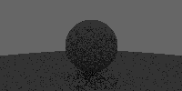

# raytrace-arm64
Simple toy grayscale raytracer written in arm64 assembly with NEON instructions. Runs on Linux.

With default settings produces the following image in PPM-format:



## Running
Dependencies:
- GCC toolchain for aarch64.
- QEMU for aarch64 or native aarch64 device. 'make run' uses QEMU.

```
make run
```
